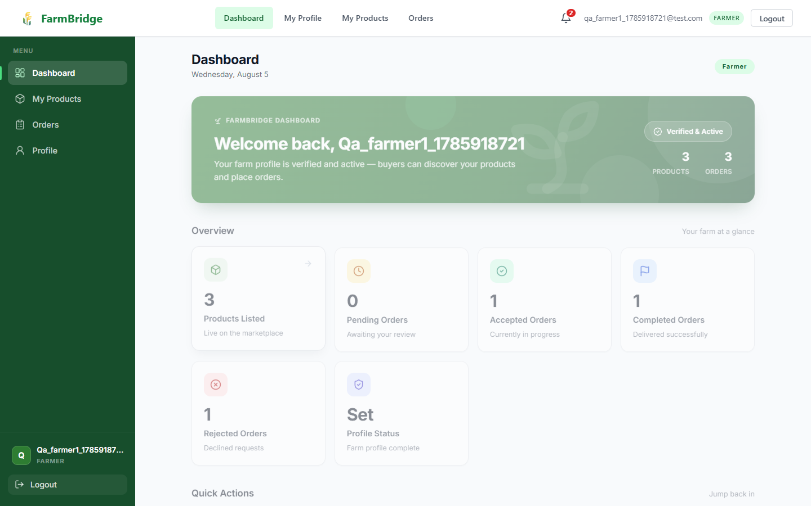
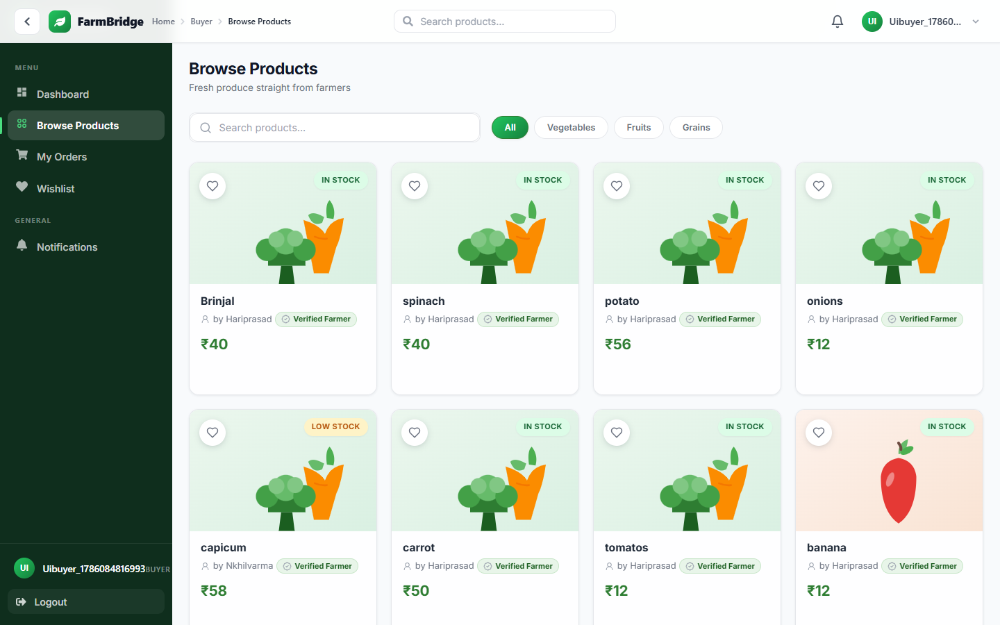
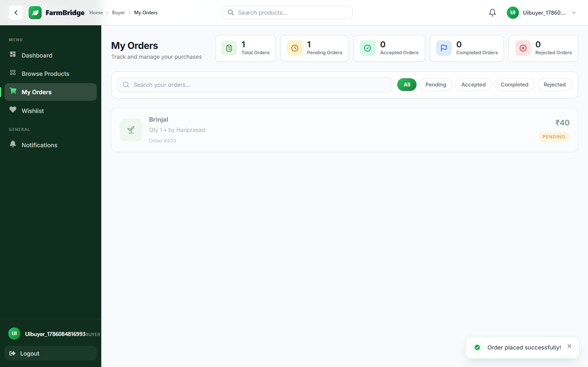
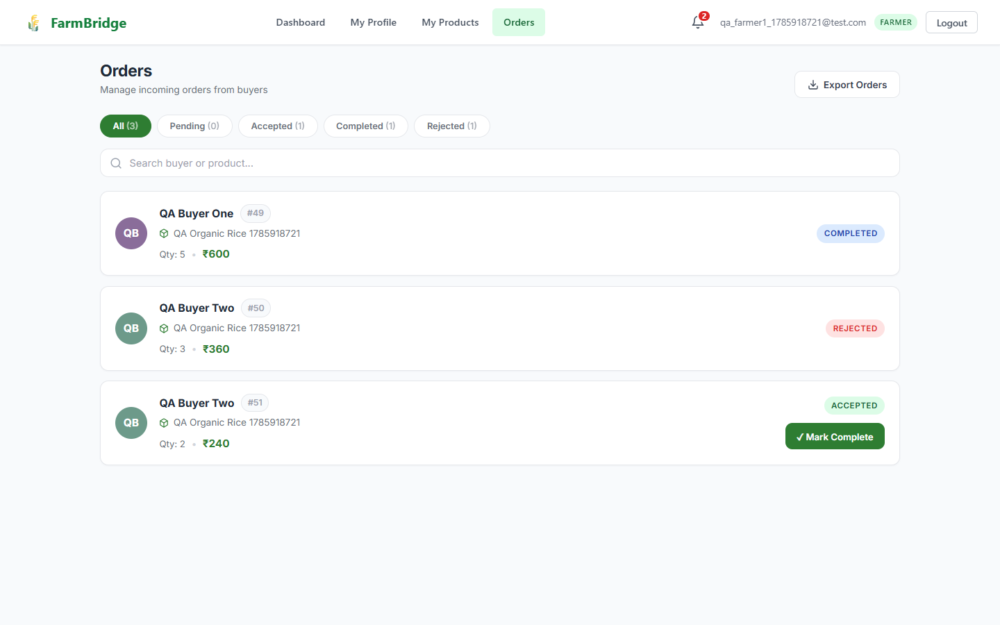
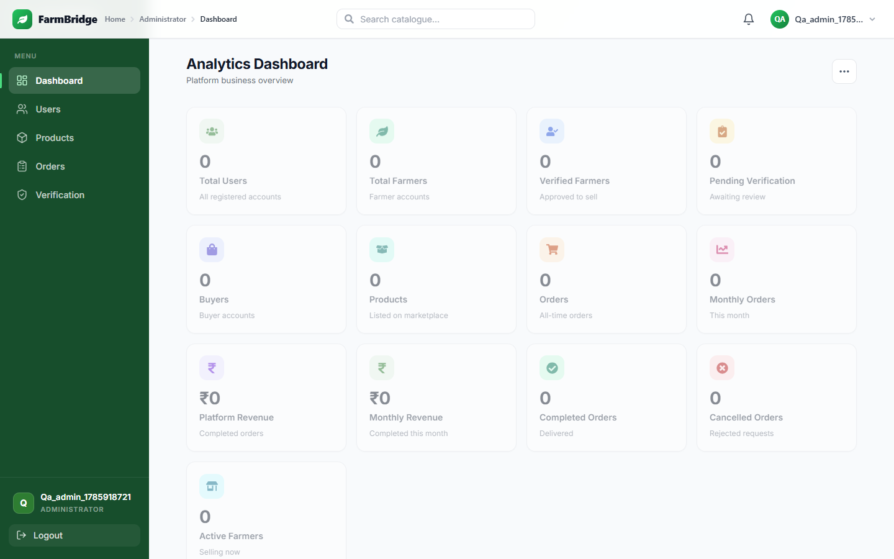
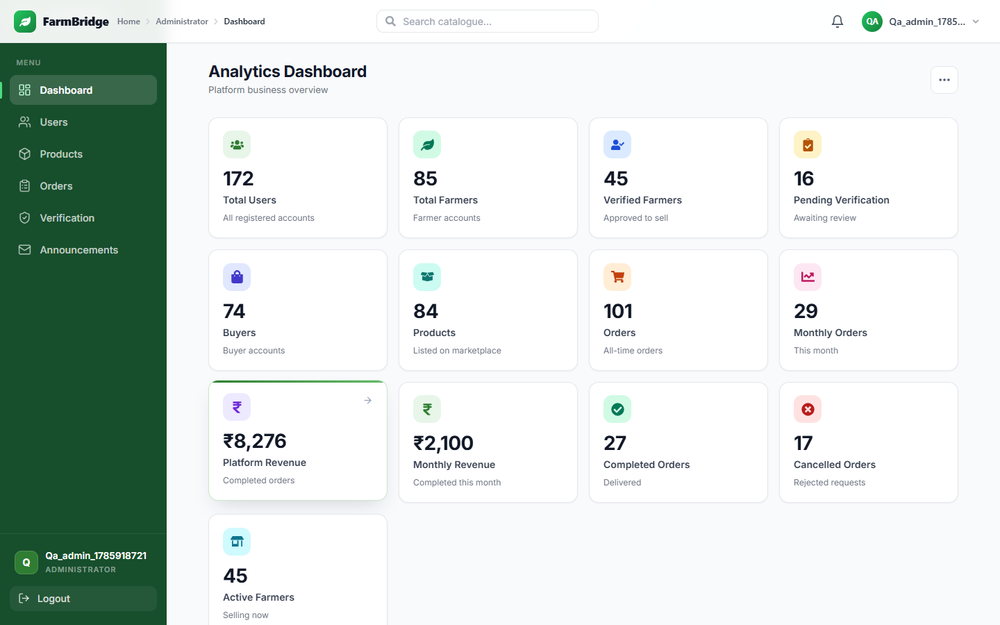
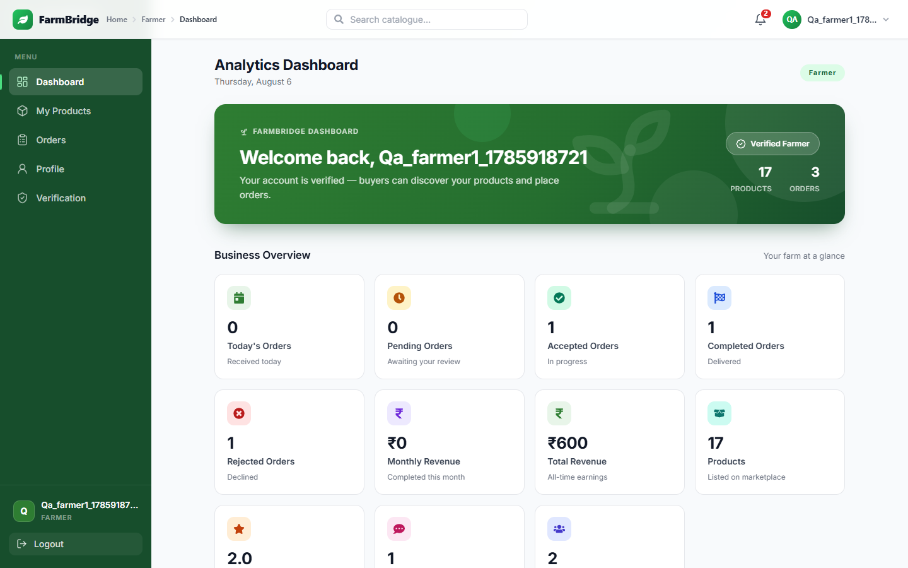
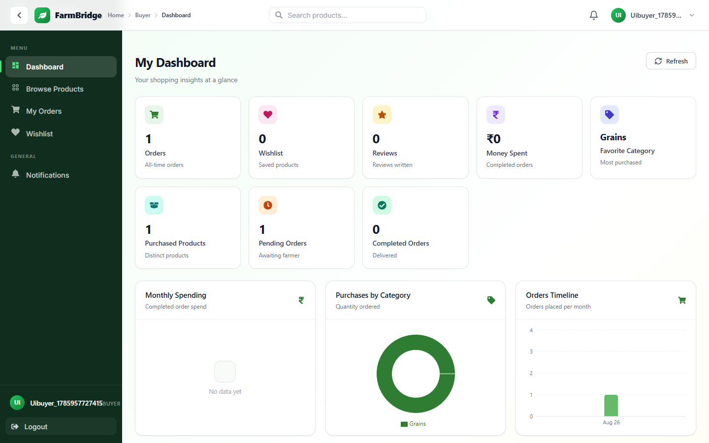

# FarmBridge

FarmBridge is a full-stack digital marketplace that connects farmers directly
with buyers, removing unnecessary intermediaries. Farmers can list their
produce and manage incoming orders, buyers can browse products and place
orders, and administrators can manage users, products, and farmer
verifications. The platform is built with a Spring Boot REST API secured by
JWT and a responsive React frontend.

[](https://github.com/hariprasaddev/FarmBridge/actions/workflows/ci-cd.yml)

## Features

- JWT Authentication
- Role-Based Access Control
- Farmer Module
- Buyer Module
- Admin Module
- Product Management
- Product Search API + Server-Side Pagination & Sorting
- Order Management
- Farmer Verification
- Analytics Dashboards (Admin / Farmer / Buyer)
- Swagger API Documentation
- Responsive React Frontend

## Tech Stack

### Frontend

- React
- JavaScript
- CSS
- Recharts (charts)
- React Icons

### Backend

- Java
- Spring Boot
- Spring Security
- Hibernate
- JPA

### Database

- MySQL

### Tools

- Git
- GitHub
- Swagger
- Postman

## Project Architecture

The application follows a layered architecture on the backend.

```text
Controller
    ↓
Service
    ↓
Repository
    ↓
MySQL
```

- **Controller** — Handles HTTP requests and routes them to services.
- **Service** — Contains the application's business logic.
- **Repository** — Data access layer built on Spring Data JPA.
- **MySQL** — Relational database storing all application data.

The frontend is a React single-page application that communicates with the
backend through a REST API secured with JWT tokens.

## Folder Structure

```text
FarmBridge/                      # Repository root
├── docs/                        # Project documentation
└── FarmBridge/                  # Application (backend + frontend)
    ├── src/                     # Spring Boot backend
    │   ├── main/
    │   │   ├── java/com/farmbridge/
    │   │   │   ├── config/      # Security, OpenAPI config
    │   │   │   ├── controller/  # REST controllers
    │   │   │   ├── dto/         # Request/response DTOs
    │   │   │   ├── entity/      # JPA entities
    │   │   │   ├── exception/   # Global exception handling
    │   │   │   ├── repository/  # Spring Data JPA repositories
    │   │   │   ├── security/    # JWT auth and filters
    │   │   │   └── service/     # Business logic
    │   │   └── resources/
    │   │       └── application.properties
    │   └── test/                # Backend tests
    ├── frontend/                # React frontend
    │   └── src/
    │       ├── components/      # Reusable UI components
    │       ├── context/         # Auth context and providers
    │       ├── pages/           # Route-level pages
    │       └── services/        # API service layer
    ├── pom.xml                  # Maven build configuration
    ├── mvnw                     # Maven wrapper (Unix)
    └── mvnw.cmd                 # Maven wrapper (Windows)
```

## API Modules

- **Authentication** — User registration and login, JWT token generation.
- **User** — User account management and profile data.
- **Farmer Profile** — Create, read, and update farmer profile information.
- **Products** — Product listing, browsing, and admin overview.
- **Orders** — Order placement, tracking, and management.
- **Admin** — Statistics, user management, and farmer verification.
- **Analytics** — Role-scoped business dashboards (Admin / Farmer / Buyer) with
  aggregated, real backend data served through single-payload endpoints.

Interactive API documentation is available through Swagger UI
(`http://localhost:8080/swagger-ui/index.html`) once the backend is running.

## Installation Steps

### Backend Setup

1. Clone the repository.

   ```bash
   git clone https://github.com/hariprasaddev/FarmBridge.git
   ```

2. Open the project in IntelliJ IDEA.

3. Configure MySQL.

   - Create a database named `farmbridge`.
   - Set the MySQL credentials via environment variables (`DB_URL`,
     `DB_USERNAME`, `DB_PASSWORD`) or edit the defaults in
     `src/main/resources/application.properties`.

4. Run the Spring Boot application.

   ```bash
   ./mvnw spring-boot:run
   ```

   The backend starts at `http://localhost:8080`. Swagger UI is available
   at `http://localhost:8080/swagger-ui/index.html`.

### Frontend Setup

1. Navigate to the frontend directory.

   ```bash
   cd frontend
   ```

2. Install the dependencies.

   ```bash
   npm install
   ```

3. Start the development server.

   ```bash
   npm run dev
   ```

   The frontend runs at `http://localhost:5173`.

## Screenshots

> Screenshots are captured by the automated browser E2E suite
> (`qa/uitest.js`) and stored in `qa/screenshots/`.

### Farmer Dashboard



### Buyer Products



### Buyer Orders



### Farmer Orders



### Admin Dashboard



### Admin Analytics Dashboard



### Farmer Analytics Dashboard



### Buyer Analytics Dashboard



## CI/CD (GitHub Actions)

The repository ships a GitHub Actions pipeline —
[`.github/workflows/ci-cd.yml`](.github/workflows/ci-cd.yml).

- **CI (Continuous Integration):** every pull request and every push to
  `main` builds the Spring Boot backend (Java 25 / Maven) and runs its full
  integration test suite against a throwaway **MySQL 8 service container**,
  then installs (`npm ci`) and builds (`npm run build`) the React frontend
  (Node 22). These jobs require **no secrets**.
- **CD (Continuous Delivery — images):** when a commit lands on `main` and
  all checks pass, the pipeline logs in to Docker Hub and publishes both
  images tagged `latest` and with the Git commit SHA:
  - `<DOCKERHUB_USERNAME>/farmbridge-backend:latest` · `:<sha>`
  - `<DOCKERHUB_USERNAME>/farmbridge-frontend:latest` · `:<sha>`
- **Manual trigger:** Actions tab → **CI/CD** → **Run workflow**
  (`workflow_dispatch`) — runs CI only; it never publishes images (those
  are reserved for real pushes to `main`).

### Docker Hub setup

1. Create an account at **hub.docker.com**.
2. Generate a **Personal Access Token** (Read & Write) under Account
   Settings → Personal Access Tokens.
3. Add two repository secrets under **Settings → Secrets and variables →
   Actions**:

| Secret | Purpose |
|---|---|
| `DOCKERHUB_USERNAME` | Docker Hub username (image prefix — must be **lowercase**) |
| `DOCKERHUB_TOKEN` | Docker Hub personal access token |

### What happens when you push

- **PR branch push** → the CI build/test check appears on the pull request.
- **Push to `main`** → CI runs first; on success the publish job builds both
  Docker images and pushes `latest` + the commit SHA to Docker Hub.

### Run the published images

```bash
docker pull <DOCKERHUB_USERNAME>/farmbridge-backend:latest
docker pull <DOCKERHUB_USERNAME>/farmbridge-frontend:latest

docker run -d --name farmbridge-backend -p 8080:8080 \
  -e DB_URL=jdbc:mysql://host:3306/farmbridge \
  -e DB_USERNAME=farmbridge -e DB_PASSWORD='***' -e JWT_SECRET='***' \
  <DOCKERHUB_USERNAME>/farmbridge-backend:latest

docker run -d --name farmbridge-frontend -p 5173:8080 \
  -e BACKEND_UPSTREAM=host.docker.internal:8080 \
  <DOCKERHUB_USERNAME>/farmbridge-frontend:latest
```

Linux hosts: add `--add-host host.docker.internal:host-gateway` to the
frontend run. See [`docs/10_DEPLOYMENT.md`](docs/10_DEPLOYMENT.md) §5 and
[`docs/reports/CICD.md`](docs/reports/CICD.md) for the full walkthrough,
including how to verify the published images.

## Future Enhancements

- Payment Gateway / shopping cart
- AI Crop Recommendation

## Author

Mukkera Hariprasad

GitHub: [https://github.com/hariprasaddev](https://github.com/hariprasaddev)

---

## API Documentation

### Project Overview

FarmBridge exposes a REST API secured with **JWT Bearer tokens**. The API
covers Authentication, Admin, Farmer, Buyer, Reviews, Wishlist, Notifications,
Forgot/Reset Password, Farmer Verification, and Analytics modules. Full
interactive documentation is available through Swagger UI.

Analytics dashboards:

| Dashboard | Endpoint | Charts |
|---|---|---|
| Admin | `GET /api/admin/analytics` | Revenue & orders per month, farmer registrations, product categories (pie), order status (donut), top-selling categories |
| Farmer | `GET /api/farmer/analytics` | Revenue & orders trend, sales per product/month, rating trend, category sales |
| Buyer | `GET /api/buyer/analytics` | Monthly spending, purchases by category, orders timeline |

### Technologies

- **Backend:** Java, Spring Boot, Spring Security, Spring Data JPA, Hibernate,
  MySQL, Spring Mail, JWT (jjwt), Springdoc OpenAPI (Swagger)
- **Frontend:** React, JavaScript, CSS, Vite, Recharts, React Icons

### Swagger UI

- **Swagger UI:** http://localhost:8080/swagger-ui/index.html
- **OpenAPI JSON:** http://localhost:8080/v3/api-docs
- **API documentation:** [`docs/API_DOCUMENTATION.md`](docs/API_DOCUMENTATION.md)

### Postman Collection

A complete Postman collection with every endpoint is provided:

- **Collection:** [`docs/FarmBridge_API.postman_collection.json`](docs/FarmBridge_API.postman_collection.json)
- **Environment:** [`docs/FarmBridge_Environment.postman_environment.json`](docs/FarmBridge_Environment.postman_environment.json)

Import both into Postman, run **Login** (Authentication folder) to auto-capture
the JWT into the `token` environment variable, then call any protected endpoint.

### Environment Variables

The backend reads configuration from environment variables. Create a `.env`
or export them in your shell before starting the application:

| Variable | Purpose |
|---|---|
| `DB_URL` | MySQL JDBC URL (e.g. `jdbc:mysql://localhost:3306/farmbridge`) |
| `DB_USERNAME` | MySQL username |
| `DB_PASSWORD` | MySQL password |
| `JWT_SECRET` | HMAC key used to sign JWTs (≥ 32 characters) |
| `MAIL_HOST` | SMTP host (e.g. `smtp.gmail.com`) |
| `MAIL_PORT` | SMTP port (e.g. `587`) |
| `MAIL_USERNAME` | SMTP username (e.g. Gmail address) |
| `MAIL_PASSWORD` | SMTP password / Google App Password |
| `APP_RESET_PASSWORD_URL` | Frontend reset-page URL used in reset emails |

Example:

```bash
export DB_URL=jdbc:mysql://localhost:3306/farmbridge
export DB_USERNAME=root
export DB_PASSWORD=your_password
export JWT_SECRET=ChangeMeToALongRandomSecretForProduction
```
